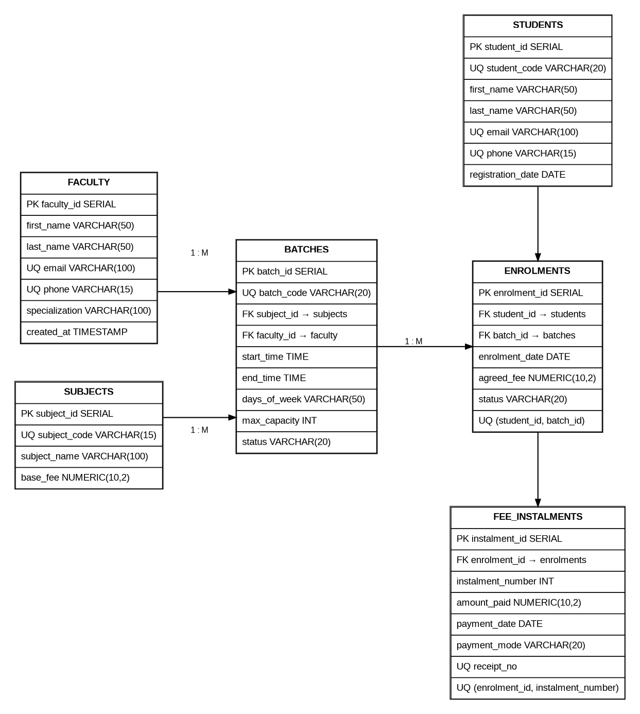

# 📚 Tuition Class Batch & Fee Ledger System
> **A robust relational database case study modeling tuition batches, student enrolments, multi-instalment fee tracking, and race-free concurrent seat allocation in PostgreSQL.**

[](#)
[](#)
[](#)
[](#)

---

## 📑 Table of Contents
- [1. Problem Statement](#1-problem-statement)
- [2. System Architecture & ER Diagram](#2-system-architecture--er-diagram)
- [3. Schema & Data Dictionary](#3-schema--data-dictionary)
- [4. Key Design Decisions & Alternatives](#4-key-design-decisions--alternatives)
- [5. Concurrency Control & Race Condition Fix](#5-concurrency-control--race-condition-fix)
- [6. Transactions & SAVEPOINTs](#6-transactions--savepoints)
- [7. Analytical Queries & Reports](#7-analytical-queries--reports)
- [8. ACID Compliance Demonstration](#8-acid-compliance-demonstration)
- [9. Quick Start & Execution Guide](#9-quick-start--execution-guide)
- [10. Project Structure & Deliverables](#10-project-structure--deliverables)

---

## 1. Problem Statement

A tuition centre operates subject batches with fixed timings and strict seat limits. It enrols students across multiple subject batches and collects fees flexibly across multiple instalments. 

The database system must reliably handle:
- **Core Operations**: Daily student registration, multi-batch enrolments, and flexible instalment payments.
- **Business Rule Enforcement**: Strict capacity enforcement preventing overbooking under high-concurrency seat grabs.
- **Reporting & Auditing**: Real-time batch-wise outstanding fee calculations, multi-batch student tracking, and monthly revenue collection aggregates.

---

## 2. System Architecture & ER Diagram

The database is normalized to **3rd Normal Form (3NF)** with strict referential integrity (`ON DELETE CASCADE` / `RESTRICT`).



### Cardinality & Relationships
- **Faculty `1 : M` Batches**: One teacher instructs zero or more batches; each batch has exactly one assigned teacher.
- **Subject `1 : M` Batches**: Each subject can have multiple scheduled batches.
- **Student `M : N` Batches**: Resolved via the **`enrolments`** associative entity with a composite unique constraint `(student_id, batch_id)`.
- **Enrolment `1 : M` Fee Instalments**: An enrolment can have multiple payments logged against it with unique instalment sequences.

---

## 3. Schema & Data Dictionary

| Table | Primary Key | Foreign Keys | Key Constraints / Purpose |
| :--- | :--- | :--- | :--- |
| **`faculty`** | `faculty_id` | — | Unique `email`, `phone`. Stores teaching staff and specializations. |
| **`subjects`** | `subject_id` | — | Unique `subject_code`, `base_fee > 0`. |
| **`batches`** | `batch_id` | `subject_id`, `faculty_id` | Unique `batch_code`, `end_time > start_time`, `max_capacity > 0`. |
| **`students`** | `student_id` | — | Unique `student_code`, `email`, `phone`. |
| **`enrolments`** | `enrolment_id` | `student_id`, `batch_id` | `UNIQUE(student_id, batch_id)`, `agreed_fee >= 0`. |
| **`fee_instalments`**| `instalment_id`| `enrolment_id` | `UNIQUE(enrolment_id, instalment_number)`, `amount_paid > 0`. |

---

## 4. Key Design Decisions & Alternatives

### 1. `enrolments` as an Associative Entity
- **Rationale**: A student can join multiple batches, and a batch can contain multiple students ($M:N$).
- **Rejected Alternative**: Storing batch IDs as array columns or repeated columns (`batch_1`, `batch_2`) inside `students`. This violates 1NF, prevents declarative foreign key checks, and complicates searching and indexing.

### 2. Multi-Row `fee_instalments` Table
- **Rationale**: An enrolment may have many payments over time, requiring separate row records with individual receipt tracking.
- **Rejected Alternative**: Storing `payment_1`, `payment_2`, `payment_3` columns in `enrolments`. This imposes an arbitrary fixed limit and introduces repeating groups and NULL bloat.

### 3. Exact Monetary Representation (`NUMERIC(10,2)`)
- **Rationale**: Used for `base_fee`, `agreed_fee`, and `amount_paid`.
- **Rejected Alternative**: Floating-point (`REAL`, `FLOAT`, `DOUBLE PRECISION`) types, which introduce binary rounding errors in financial balances and audits.

### 4. Dynamic Capacity Enforcement vs. Stored Counter
- **Rationale**: Capacity is verified dynamically using active row counts guarded by transaction row-level locking.
- **Rejected Alternative**: Storing a mutable `available_seats` counter column in `batches`. A counter duplicates information and easily drifts out of sync if an enrolment, drop, or cancellation fails mid-operation.

---

## 5. Concurrency Control & Race Condition Fix

### The Overbooking Anomaly (Race Condition)
When a batch has only **1 seat remaining** and two sessions attempt simultaneous enrolment:
```text
Session 1: Reads active count = 2 (Capacity = 3) -> Thinks seat is available
Session 2: Reads active count = 2 (Capacity = 3) -> Thinks seat is available
Session 1: Inserts enrolment -> Active count = 3
Session 2: Inserts enrolment -> Active count = 4  <-- [CRITICAL: OVERBOOKING ANOMALY]
```

### The Solution: Row-Level Locking (`FOR UPDATE`)
By acquiring an exclusive lock on the target batch row in `READ COMMITTED` isolation, the second registration transaction is serialized:

```sql
BEGIN;
SET TRANSACTION ISOLATION LEVEL READ COMMITTED;

-- 1. Acquire exclusive lock on the target batch row
SELECT batch_id, max_capacity
FROM batches
WHERE batch_id = 3 AND status = 'ACTIVE'
FOR UPDATE;

-- 2. Safely count active enrolments while holding the lock
SELECT COUNT(*) 
FROM enrolments 
WHERE batch_id = 3 AND status = 'ACTIVE';

-- 3. Insert only if count < max_capacity
INSERT INTO enrolments (student_id, batch_id, agreed_fee, status)
VALUES (10, 3, 12000.00, 'ACTIVE');

COMMIT;
```

`READ COMMITTED` with explicit row locking avoids the abort-and-retry overhead of `SERIALIZABLE` transactions while providing deterministic capacity protection.

---

## 6. Transactions & SAVEPOINTs

[`transaction.sql`](transaction.sql) demonstrates fine-grained error recovery within a single transaction using PostgreSQL **`SAVEPOINT`**:

```text
[BEGIN TRANSACTION]
       │
       ▼
 [Insert Enrolment] ───────────► (Success)
       │
       ▼
 [SAVEPOINT sp_before_payment]
       │
       ▼
 [Insert Invalid Payment ($0)] ──► 💥 CHECK (amount_paid > 0) Violation
       │
       ▼
 [ROLLBACK TO SAVEPOINT] ──────► (Restores to pre-payment state without losing Enrolment)
       │
       ▼
 [Insert Valid Payment] ───────► (Success)
       │
       ▼
    [COMMIT] ──────────────────► All valid operations permanently persisted
```

---

## 7. Analytical Queries & Reports

All queries are documented with execution rationale and expected outputs in [`queries.sql`](queries.sql).

<details>
<summary><b>1. Outstanding Fee Calculation per Batch</b> (Click to expand)</summary>

```sql
SELECT 
    b.batch_id,
    b.batch_code,
    s.subject_name,
    COUNT(e.enrolment_id) AS total_active_enrolments,
    COALESCE(SUM(e.agreed_fee), 0.00) AS total_agreed_fee,
    COALESCE(SUM(f.total_paid), 0.00) AS total_paid_fee,
    COALESCE(SUM(e.agreed_fee), 0.00) - COALESCE(SUM(f.total_paid), 0.00) AS outstanding_fee
FROM batches b
JOIN subjects s ON b.subject_id = s.subject_id
LEFT JOIN enrolments e ON b.batch_id = e.batch_id AND e.status = 'ACTIVE'
LEFT JOIN (
    SELECT enrolment_id, SUM(amount_paid) AS total_paid
    FROM fee_instalments
    GROUP BY enrolment_id
) f ON e.enrolment_id = f.enrolment_id
GROUP BY b.batch_id, b.batch_code, s.subject_name
ORDER BY b.batch_id;
```
> **Optimization Note**: Aggregates instalments in a subquery prior to joining to prevent Cartesian row multiplication on multiple payments.
</details>

<details>
<summary><b>2. Multi-Batch Students (`HAVING COUNT > 2`)</b> (Click to expand)</summary>

```sql
SELECT 
    s.student_id,
    s.student_code,
    s.first_name || ' ' || s.last_name AS student_name,
    COUNT(e.enrolment_id) AS enrolled_batches_count
FROM students s
JOIN enrolments e ON s.student_id = e.student_id
WHERE e.status = 'ACTIVE'
GROUP BY s.student_id, s.student_code, s.first_name, s.last_name
HAVING COUNT(e.enrolment_id) > 2
ORDER BY s.student_id;
```
</details>

<details>
<summary><b>3. Full Capacity Batch Detector</b> (Click to expand)</summary>

```sql
SELECT 
    b.batch_id,
    b.batch_code,
    b.max_capacity,
    COUNT(e.enrolment_id) AS current_active_enrolments
FROM batches b
LEFT JOIN enrolments e ON b.batch_id = e.batch_id AND e.status = 'ACTIVE'
GROUP BY b.batch_id, b.batch_code, b.max_capacity
HAVING COUNT(e.enrolment_id) >= b.max_capacity
ORDER BY b.batch_id;
```
</details>

<details>
<summary><b>4. Monthly Fee Collection Trend</b> (Click to expand)</summary>

```sql
SELECT 
    TO_CHAR(payment_date, 'YYYY-MM') AS collection_month,
    SUM(amount_paid) AS total_collected
FROM fee_instalments
GROUP BY TO_CHAR(payment_date, 'YYYY-MM')
ORDER BY collection_month;
```
</details>

---

## 8. ACID Compliance Demonstration

- **Atomicity**: The transaction either commits completely or rolls back. The `SAVEPOINT` mechanism demonstrates partial intra-transaction error recovery without losing valid preceding state.
- **Consistency**: The schema strictly enforces domain invariants via Primary Keys, Foreign Keys, `UNIQUE(student_id, batch_id)`, and `CHECK` constraints (`amount_paid > 0`, `end_time > start_time`).
- **Isolation**: Row-level locks (`SELECT ... FOR UPDATE`) in `READ COMMITTED` isolation guarantee serialized capacity validation during concurrent registrations.
- **Durability**: Upon `COMMIT`, all modifications are flushed to PostgreSQL's Write-Ahead Log (WAL), surviving unexpected crashes or restarts.

---

## 9. Quick Start & Execution Guide

### Prerequisites
- PostgreSQL 14+ or Docker

### Execution Steps
```bash
# 1. Create database
createdb tuition_db

# 2. Run DDL schema and indexes
psql -d tuition_db -f schema.sql

# 3. Seed sample data
psql -d tuition_db -f seed.sql

# 4. Run analytical queries and verify outputs
psql -d tuition_db -f queries.sql

# 5. Execute transaction and SAVEPOINT demonstration
psql -d tuition_db -f transaction.sql

# 6. Execute two-session concurrency transcript
psql -d tuition_db -f concurrency_transcript.sql
```

---

## 10. Project Structure & Deliverables

```text
.
├── ER_Diagram.png             # Visual Entity-Relationship Diagram
├── ER_Diagram.pdf             # Printable Vector ER Diagram
├── schema.sql                 # DDL: Tables, constraints, foreign keys, and indexes
├── seed.sql                   # DML: Realistic seed records for all entities
├── queries.sql                # Reporting queries with expected tabular outputs
├── transaction.sql            # Transaction integrity & SAVEPOINT demonstration
├── concurrency_transcript.sql # Two-session concurrency & locking execution log
└── README.md                  # Complete case study documentation
```
